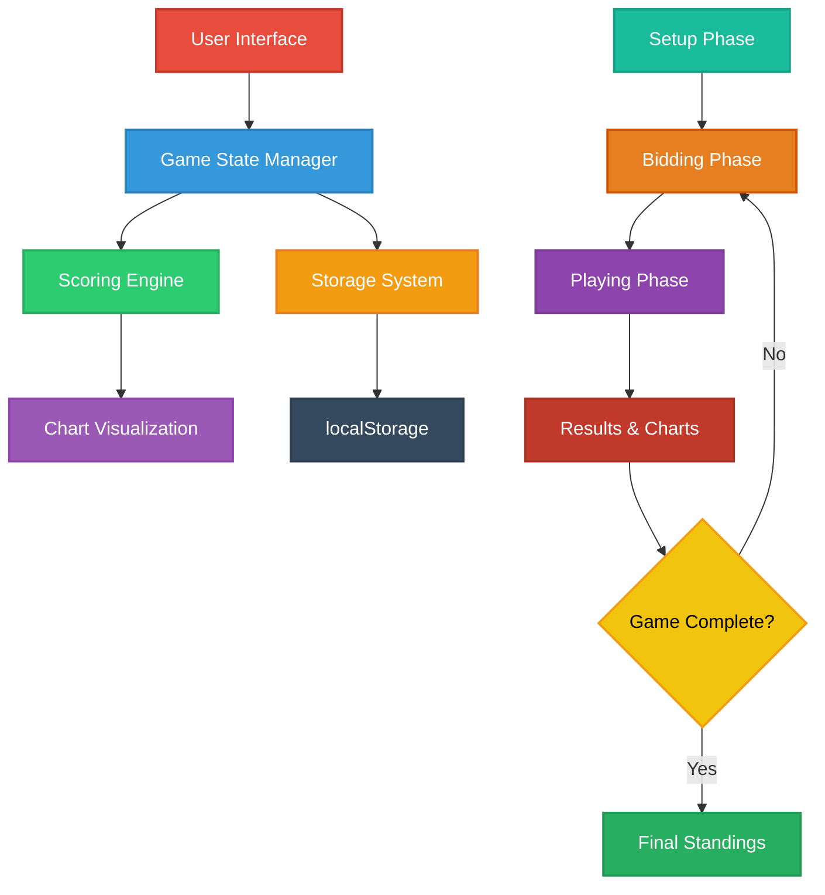
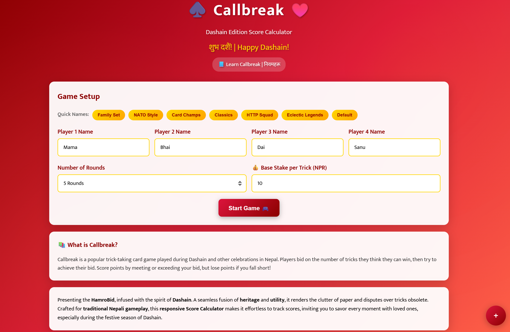
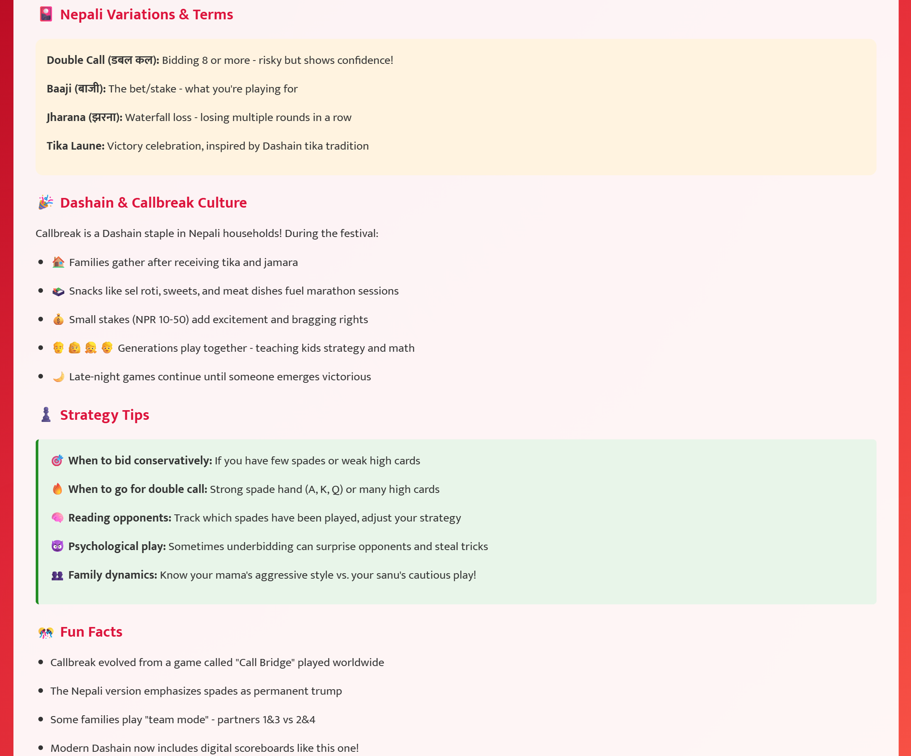
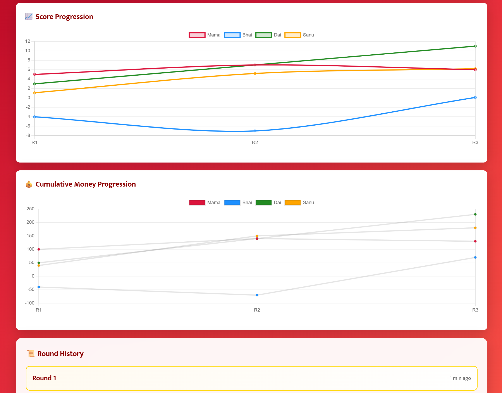

# 🎴 HamroBid - Callbreak Score Calculator

> **शुभ दशैं! | Happy Dashain!** 🎉

Presenting the **HamroBid**, infused with the spirit of **Dashain**. A seamless fusion of **heritage** and **utility**, it renders the clutter of paper and disputes over tricks obsolete.

Crafted for **traditional Nepali gameplay**, this **responsive Score Calculator** makes it effortless to track scores, inviting you to savor every moment with loved ones, especially during the festive season of Dashain.

  

## 📚 Documentation

For complete methodology and technical details: [Technical Whitepaper](WHITEPAPER.md) - Detailed technical architecture and implementation guide

## ✨ Features

🎯 **Smart Score Tracking**
- Real-time score calculation with bid accuracy tracking
- Cumulative score progression with visual charts
- Round-by-round history with expandable details

💰 **Money Bidding System**
- Customizable stake amounts per trick
- Bonus bidding for high-risk, high-reward gameplay
- Persistent pot system that accumulates across rounds
- Failed bonus bids contribute to winner's final pot

📊 **Visual Analytics**
- Interactive Chart.js score progression graphs
- Money flow visualization across rounds
- Player performance statistics and accuracy metrics

🎮 **Enhanced Gameplay**
- Auto-save functionality with localStorage
- Resume interrupted games seamlessly
- Export game results to CSV format
- Keyboard shortcuts (Enter key for submissions)
- Proper tab navigation for accessibility

📱 **Responsive Design**
- Mobile-first approach for all device sizes
- Touch-friendly interface for tablets and phones
- Elegant Dashain-themed UI with Nepali cultural elements

⚙️ **Customizable Settings**
- Adjustable number of rounds (5, 7, or 10)
- Variable base stake amounts
- Quick preset player names (Family Set, NATO Style, Card Champs, etc.)
- Multiple themed name presets for different groups

## 🌐 Live Demonstration 

Want to skip the scorekeeping drama this Dashain? Experience the magic of **HamroBid**, a smart and culturally rooted Callbreak Score Calculator designed for Nepali households.

Try the **Live Demo** now: [https://hamrobid.netlify.app](https://hamrobid.netlify.app)

### Prerequisites
- Modern web browser (Chrome, Firefox, Safari, Edge)
- No additional software required!

## 🚀 Quick Start

### Installation

1. **Clone the repository**
   ```bash
   git clone https://github.com/binayakbartaula11/HamroBid.git
   cd HamroBid
   ```

2. **Open in browser**
   ```bash
   # Simply open index.html in your browser
   open index.html
   # or double-click the file
   ```

3. **Start playing!** 🎉

## 🎯 How to Use

### 1. Game Setup
- Enter player names (or use quick presets)
- Set number of rounds (5, 7, or 10)
- Configure base stake amount in NPR
- Click "Start Game"

### 2. Bidding Phase
- Each player enters their bid (1-13 tricks)
- Optional: Add bonus bids for extra stakes
- System warns if total bids exceed 13
- **Keyboard Support**: Press Enter to submit bids
- **Tab Navigation**: Logical tab order through all fields

### 3. Playing Phase
- Enter actual tricks won by each player
- System validates total tricks equal 13
- Automatic score calculation and money distribution
- **Keyboard Support**: Press Enter to calculate scores
- **Pot Tracking**: See accumulated pot from failed bonus bids

### 4. Game Progression
- View real-time scoreboard with leader indicators
- Check score progression charts
- Review detailed round history
- Export results when game ends

### 5. Game Management
- **Auto-save**: Game saves automatically
- **Resume**: Continue interrupted games
- **Reset**: Start fresh anytime
- **Export**: Download CSV results

## 🛠️ Tech Stack

- **Frontend**: HTML5, CSS3, Vanilla JavaScript
- **Charts**: Chart.js for data visualization
- **Storage**: localStorage for game persistence
- **Fonts**: Google Fonts (Mukta)
- **Icons**: Unicode emojis for cross-platform compatibility

**No frameworks, no build process - just pure web technologies!**

## 🏗️ Architecture Overview



## 📁 Project Structure

```
HamroBid/
├── index.html              # Main entry point
├── README.md               # Project documentation
├── WHITEPAPER.md           # Technical documentation
├── assets/                 # Static assets
│   ├── screenshot/         # UI screenshots
│   │   ├── home_ui.png
│   │   ├── game_info_ui.png
│   │   ├── bidding_scoreboard_ui.png
│   │   └── progression_charts_ui.png
│   ├── favicon.svg         # Browser favicon
│   └── hamrobid-icon.png   # App icon
├── css/
│   └── styles.css          # All styling
└── js/
    ├── main.js             # Main game initialization
    ├── gameState.js        # Game state management
    ├── ui.js               # UI functions & DOM manipulation
    ├── scoring.js          # Game logic & scoring calculations
    ├── storage.js          # localStorage & CSV export
    ├── charts.js           # Chart.js functionality
    └── fab.js              # Floating Action Button functionality
```

## 🎮 Game Rules

### Scoring System
- **Successful bid**: +bid points + 0.1 per extra trick
- **Failed bid**: -bid points
- **Example**: Bid 5, win 7 = +5.2 points
- **Example**: Bid 5, win 3 = -5 points

### Money System
- Base stake × tricks won + bonus (if successful)
- Failed bids lose base stake × bid amount
- **Pot System**: Failed bonus bids accumulate in pot across rounds
- **Final Distribution**: Accumulated pot goes to game winner
- Real-time pot tracking with persistent display

### Special Terms
- **Double Call (डबल कल)**: Bidding 8+ tricks
- **Baaji (बाजी)**: The stake/bet amount
- **Jharana (झरना)**: Consecutive round losses

## 🤝 Contributing

We welcome contributions! Here's how you can help:

1. **Fork the repository**
2. **Create a feature branch**
   ```bash
   git checkout -b feature/amazing-feature
   ```
3. **Make your changes**
4. **Commit with clear messages**
   ```bash
   git commit -m "Add amazing feature"
   ```
5. **Push to your branch**
   ```bash
   git push origin feature/amazing-feature
   ```
6. **Open a Pull Request**

### Areas for Contribution
- 🌐 Localization (more languages)
- 🎨 UI/UX improvements
- 📱 Mobile app version
- 🔧 Performance optimizations
- 📚 Documentation improvements

## 📸 Screenshots

| **Home Page UI**                              | **Game Info & Tips UI**                         |
| --------------------------------------------- | ----------------------------------------------- |
|  |  |

| **Bidding Phase UI**                          | **Progression Charts & Round Results UI**       |
| --------------------------------------------- | ----------------------------------------------- |
|  |  |

## 🎊 Cultural Context

Callbreak is more than just a card game in Nepal - it's a Dashain tradition that brings families together. During the festival:

- 🏠 Families gather after receiving tika and jamara
- 🍱 Games are fueled by sel roti, sweets, and festive meals
- 💰 Small stakes add excitement and friendly competition
- 👨‍👩‍👧‍👦 Multiple generations play together, teaching strategy
- 🌙 Marathon sessions often last late into the night

HamroBid digitizes this beautiful tradition while preserving its cultural essence.

## 📄 License

This project is licensed under the MIT License - see the [LICENSE](LICENSE) file for details.

## 🌟 Acknowledgments

- Traditional Callbreak players of Nepal for inspiration
- The Dashain festival for bringing families together
- Chart.js for beautiful data visualization
- Google Fonts for typography
- The open-source community for continuous inspiration

### 🎭 The "fun" side of acknowledgments

- Traditional Callbreak players of Nepal – for proving that diplomacy is optional, but strategy is mandatory.
- AWS Amazon Q – for proving AI can be confidently wrong and still sound polite 😉
- MDN Docs – the Gandalf of web development: "Read the docs, you fools!"
- VS Code – the best frenemy: fixes typos, but crashes when you need it most
- GPMs – aka "Ctrl+C → Ctrl+V University," degree included 🎓
- Ctrl+Z – humanity's greatest invention after momo
- Excel – teaching generations of Nepalis how to keep Callbreak scores before apps existed 📊
- The 'F5' key – because sometimes refreshing does fix life
- Git – daily reminders that we have trust issues: "Are you sure you want to push to main?"
- Spotify Lofi playlists – for convincing coders that 3AM debugging is zen 🎶
- Random Nepali cousins – arguing over rules mid-game and inspiring this calculator 🙃
- Nepali moms & dads – turning Callbreak into a contact sport with verbal commentary 🎤
- Excel's SUM() function – saving families from math-induced wars
- That one uncle – who always cheats but calls it "experience" 🃏
- Emoji creators – for giving us 🎴, which is basically half this README

## 📧 Contact

* **LinkedIn:** [linkedin.com/in/binayakbartaula](https://linkedin.com/in/binayakbartaula)
* **Twitter:** [@BartaulaBinayak](https://X.com/BartaulaBinayak)

> **Portfolio Website:** [https://binayakbartaula.com.np](https://binayakbartaula.com.np)

---

<div align="center">

**Made with ❤️ for the Nepali community**

*Star ⭐ this repo if you enjoyed playing HamroBid!*

[](https://github.com/binayakbartaula11/HamroBid/stargazers)
[](https://github.com/binayakbartaula11/HamroBid/network)

</div>