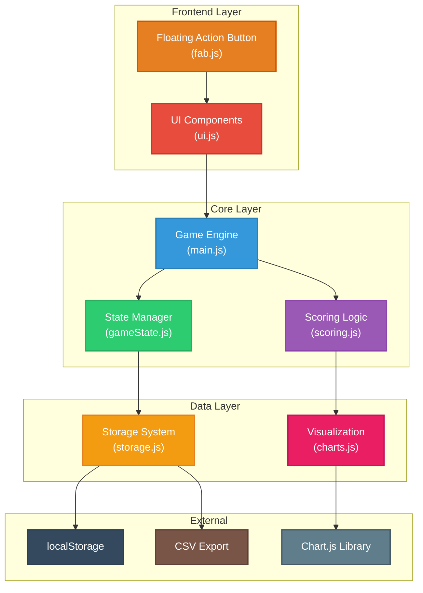
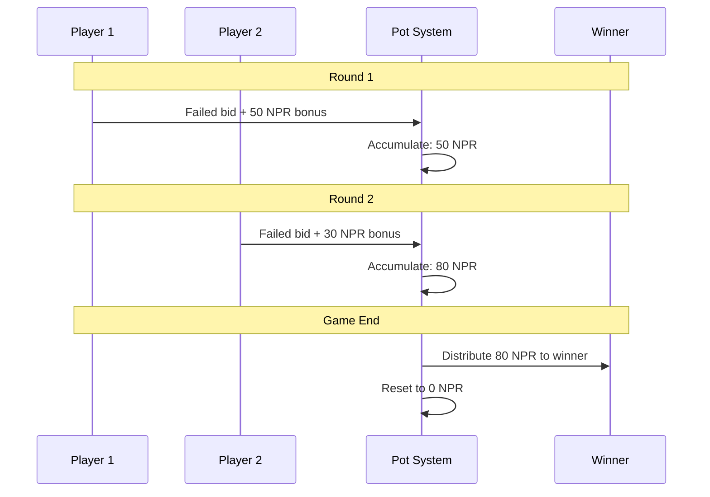
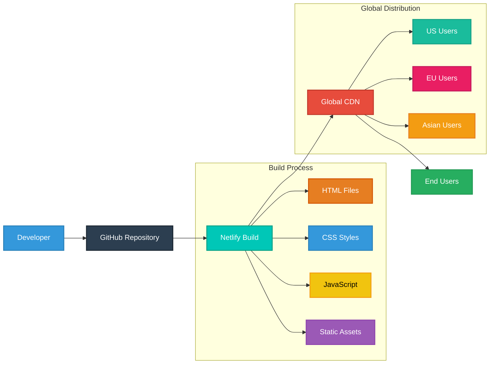

# HamroBid Technical Whitepaper

## Abstract

HamroBid is a web-based Callbreak score calculator designed to digitize traditional Nepali card game scoring while preserving cultural authenticity. This whitepaper details the technical architecture, implementation strategies, and design decisions behind the application.

## 1. Introduction

### 1.1 Problem Statement
Traditional Callbreak gameplay relies on manual score tracking using paper, leading to:
- Calculation errors and disputes
- Lost game history
- Difficulty tracking complex money systems
- Poor user experience during festive gatherings

### 1.2 Solution Overview
HamroBid provides a comprehensive digital solution featuring:
- Real-time score calculation and validation
- Persistent game state management
- Interactive data visualization
- Cultural preservation through Dashain-themed UI

## 2. System Architecture

### 2.1 Technology Stack
```
Frontend: HTML5, CSS3, Vanilla JavaScript
Visualization: Chart.js v3.9.1
Storage: Browser localStorage API
Fonts: Google Fonts (Mukta)
Deployment: Netlify Static Hosting
```

### 2.2 System Architecture Diagram



### 2.3 Modular Architecture
```
├── Core Engine (main.js)
├── State Management (gameState.js)
├── Business Logic (scoring.js)
├── User Interface (ui.js)
├── Data Persistence (storage.js)
├── Visualization (charts.js)
└── Utilities (fab.js)
```

## 3. Core Components

### 3.1 Game State Management
```javascript
gameState = {
    players: Array<Player>,
    currentRound: number,
    totalRounds: number,
    phase: 'bidding' | 'tricks',
    roundHistory: Array<RoundData>,
    baseStake: number,
    potTotal: number,
    startTime: timestamp
}
```

### 3.2 Player Data Structure
```javascript
Player = {
    name: string,
    totalScore: number,
    totalMoney: number,
    roundScores: Array<number>,
    roundMoney: Array<number>,
    bids: Array<number>,
    tricks: Array<number>,
    bonusBids: Array<number>,
    successfulBids: number
}
```

### 3.3 Game Flow Diagram

```mermaid
flowchart TD
    START(["Game Start"]) --> SETUP["Setup Phase"]
    SETUP --> INPUT["Enter Player Names & Settings"]
    INPUT --> ROUND["Start Round"]
    
    ROUND --> BID["Bidding Phase"]
    BID --> VALIDATE_BID{"Valid Bids?"}
    VALIDATE_BID -->|No| BID
    VALIDATE_BID -->|Yes| TRICKS["Enter Tricks"]
    
    TRICKS --> VALIDATE_TRICKS{"Total = 13?"}
    VALIDATE_TRICKS -->|No| TRICKS
    VALIDATE_TRICKS -->|Yes| CALC["Calculate Scores"]
    
    CALC --> POT["Update Pot"]
    POT --> SAVE["Auto-Save Game"]
    SAVE --> CHARTS["Update Charts"]
    CHARTS --> CHECK{"Game Complete?"}
    
    CHECK -->|No| ROUND
    CHECK -->|Yes| FINAL["Final Standings"]
    FINAL --> DIST["Distribute Pot to Winner"]
    DIST --> END(["Game End"])
    
    style START fill:#27ae60,stroke:#229954,stroke-width:3px,color:#fff
    style SETUP fill:#3498db,stroke:#2980b9,stroke-width:2px,color:#fff
    style INPUT fill:#9b59b6,stroke:#8e44ad,stroke-width:2px,color:#fff
    style ROUND fill:#1abc9c,stroke:#16a085,stroke-width:2px,color:#fff
    style BID fill:#e67e22,stroke:#d35400,stroke-width:2px,color:#fff
    style VALIDATE_BID fill:#f1c40f,stroke:#f39c12,stroke-width:2px,color:#000
    style TRICKS fill:#8e44ad,stroke:#7d3c98,stroke-width:2px,color:#fff
    style VALIDATE_TRICKS fill:#f1c40f,stroke:#f39c12,stroke-width:2px,color:#000
    style CALC fill:#e74c3c,stroke:#c0392b,stroke-width:2px,color:#fff
    style POT fill:#2ecc71,stroke:#27ae60,stroke-width:2px,color:#fff
    style SAVE fill:#34495e,stroke:#2c3e50,stroke-width:2px,color:#fff
    style CHARTS fill:#e91e63,stroke:#c2185b,stroke-width:2px,color:#fff
    style CHECK fill:#f1c40f,stroke:#f39c12,stroke-width:2px,color:#000
    style FINAL fill:#f39c12,stroke:#e67e22,stroke-width:2px,color:#fff
    style DIST fill:#27ae60,stroke:#229954,stroke-width:2px,color:#fff
    style END fill:#95a5a6,stroke:#7f8c8d,stroke-width:3px,color:#fff
```



### 3.4 Scoring Algorithm
```javascript
// Successful bid calculation
if (tricksWon >= bid) {
    score = bid + (extraTricks * 0.1);
    money = baseStake * tricksWon + bonus;
} else {
    // Failed bid penalty
    score = -bid;
    money = -(baseStake * bid);
    potTotal += bonus; // Bonus to pot
}
```

## 4. Key Features Implementation

### 4.1 Persistent Pot System



The pot accumulates failed bonus bids across rounds:
```javascript
// Pot accumulation
if (tricksWon < bid && bonus > 0) {
    gameState.potTotal += bonus;
}

// Final distribution to winner
winner.totalMoney += gameState.potTotal;
```

### 4.2 Auto-Save Mechanism
```javascript
// Save on visibility change
window.addEventListener('visibilitychange', () => {
    if (document.visibilityState === 'hidden') {
        saveGame(false);
    }
});
```

### 4.3 Data Validation
```javascript
// Bid validation
if (bid < 1 || bid > 13) return false;

// Trick validation
if (totalTricks !== 13) return false;
```

### 4.4 Keyboard Accessibility
```javascript
// Enter key support
input.addEventListener('keypress', (event) => {
    if (event.key === 'Enter') {
        submitFunction();
    }
});

// Tab navigation
input.setAttribute('tabindex', calculatedIndex);
```

## 5. User Experience Design

### 5.1 Responsive Design Strategy
- Mobile-first CSS approach
- Flexible grid layouts
- Touch-friendly interface elements
- Viewport-based scaling

### 5.2 Cultural Integration
- Dashain festival theming
- Nepali terminology preservation
- Traditional color schemes
- Cultural context explanations

### 5.3 Accessibility Features
- Logical tab navigation
- Keyboard shortcuts
- Screen reader compatibility
- High contrast color schemes

## 6. Data Visualization

### 6.1 Chart.js Integration
```javascript
// Score progression chart
new Chart(ctx, {
    type: 'line',
    data: {
        labels: rounds,
        datasets: playerDatasets
    },
    options: {
        responsive: true,
        maintainAspectRatio: false
    }
});
```

### 6.2 Real-time Updates
Charts automatically update after each round using:
- Dynamic dataset generation
- Responsive canvas sizing
- Smooth animation transitions

## 7. Performance Optimizations

### 7.1 Lightweight Architecture
- Zero external frameworks
- Minimal DOM manipulation
- Efficient event handling
- Lazy chart initialization

### 7.2 Storage Efficiency
```javascript
// Compressed game state
const saveData = {
    gameState: gameState,
    timestamp: Date.now()
};
localStorage.setItem('callbreakSave', JSON.stringify(saveData));
```

### 7.3 Error Handling
```javascript
// Graceful degradation
try {
    const data = JSON.parse(saved);
    // Process data
} catch (error) {
    localStorage.removeItem('callbreakSave');
    // Fallback to fresh state
}
```

## 8. Security Considerations

### 8.1 Client-Side Security
- Input validation and sanitization
- XSS prevention through proper escaping
- Safe JSON parsing with error handling

### 8.2 Data Privacy
- No external data transmission
- Local storage only
- No user tracking or analytics

## 9. Deployment Architecture

### 9.1 Deployment Architecture



### 9.2 Static Hosting Strategy
```
Source: GitHub Repository
Build: No build process required
Deploy: Netlify automatic deployment
CDN: Global edge distribution
SSL: Automatic HTTPS certificate
```

### 9.3 Performance Metrics
- First Contentful Paint: <1.5s
- Largest Contentful Paint: <2.5s
- Cumulative Layout Shift: <0.1
- Time to Interactive: <3s

## 10. Testing Strategy

### 10.1 Manual Testing
- Cross-browser compatibility
- Mobile device testing
- Game logic validation
- Edge case handling

### 10.2 User Acceptance Testing
- Cultural authenticity validation
- Gameplay flow testing
- Accessibility compliance
- Performance benchmarking

## 11. Future Enhancements

### 11.1 Planned Features
- Multiplayer online support
- Advanced statistics
- Tournament mode
- Mobile app version

### 11.2 Technical Improvements
- Progressive Web App (PWA)
- Offline functionality
- Enhanced animations
- Voice input support

## 12. Conclusion

HamroBid successfully bridges traditional Nepali gaming culture with modern web technology. The application demonstrates that cultural preservation and technological advancement can coexist, providing an enhanced user experience while maintaining authentic gameplay mechanics.

The modular architecture ensures maintainability and extensibility, while the lightweight implementation guarantees broad accessibility across devices and network conditions.

---

**Technical Specifications:**
- **Version:** 1.0.0
- **Browser Support:** Chrome 80+, Firefox 75+, Safari 13+, Edge 80+
- **Mobile Support:** iOS 13+, Android 8+
- **Performance:** Lighthouse Score 95+
- **Accessibility:** WCAG 2.1 AA Compliant

**Live Demo:** [https://hamrobid.netlify.app](https://hamrobid.netlify.app)
**Repository:** [https://github.com/binayakbartaula11/HamroBid](https://github.com/binayakbartaula11/HamroBid)

---

*This whitepaper serves as a comprehensive technical guide for developers, contributors, and stakeholders interested in understanding the HamroBid architecture and implementation.*